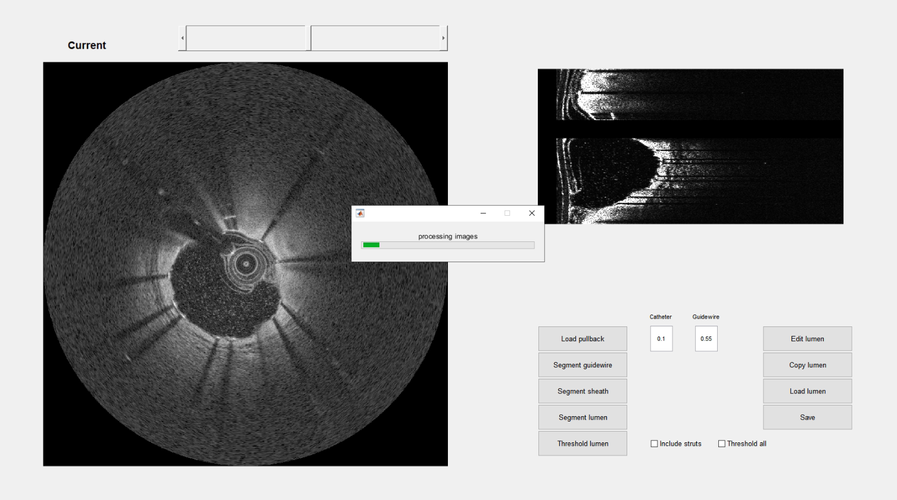
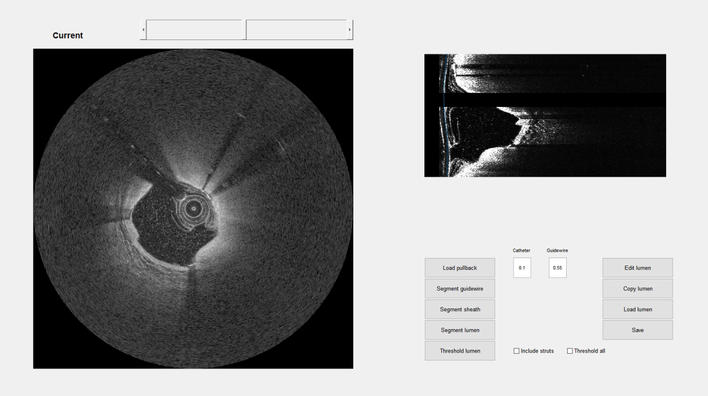
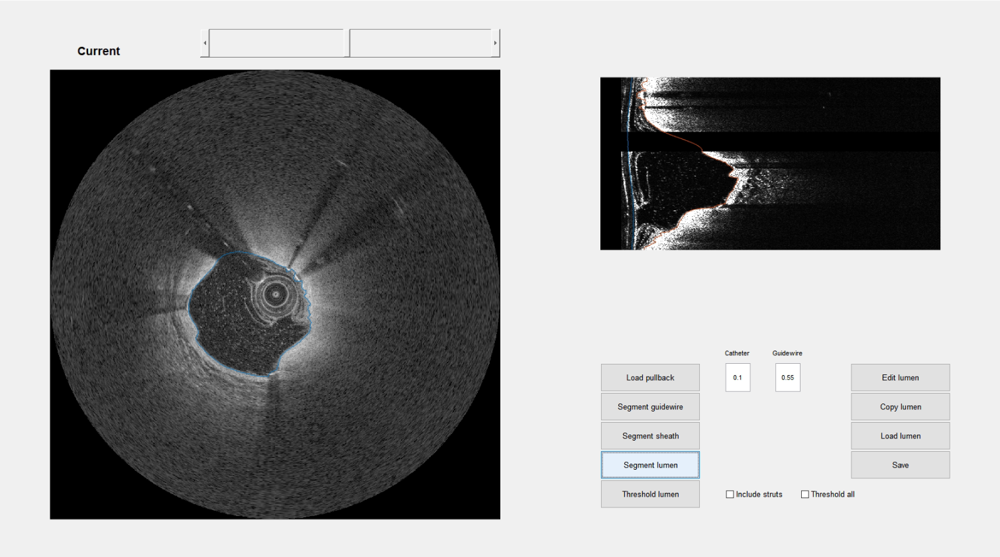
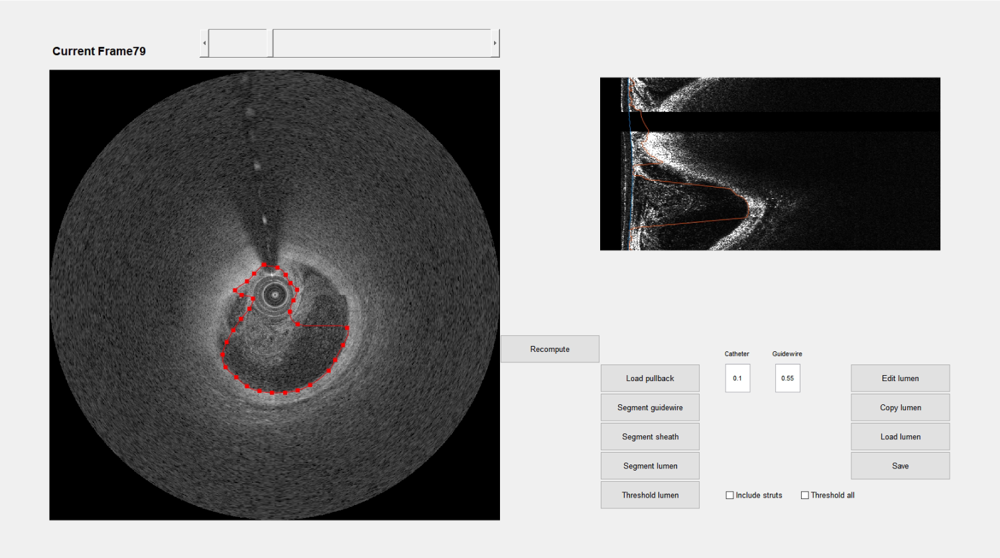

# OCT segmentation
This repository is a MatLab GUI that contains a series of functions that segments the lumen of OCT images. Users of this repository should cite the following papers  
1. Evaluation of a framework for the co-registration of intravascular ultrasound and optical coherence tomography coronary artery pullbacks. Molony DS, Timmins LH, Rasoul-Arzrumly E, Samady H, Giddens DP. 2016. *J Biomech*, Vol 49(16)
2. Volmetric quantification of fibrous caps using intravascular optical coherence tomography. Wang Z, Chamie D, Bezerra HG, Yamamoto H, Kanovsky J, Wilson DL, Costa MA, Rollins AM. 2010. *Biomed Optics Express*, Vol 3(6)

## Algorithm
The code uses a dynamic programming algorithm to segment the lumen. A cost function based on the image gradient is first calculated in the polar domain.
The cumulative cost of this cost function is then calculated. The lumen border is found by backtracking a path through the  minimum cost path of the cumulative cost image. 
Refer to Wang et al. for more details

## GUI
The user launches the GUI by typing the following in the MatLab command line
```MatLab
OCT_GUI
```

On the launch screen the user then selects to load the OCT pullback. Currently OCT data can be loaded in either it's raw format (must be converted to .tif, this can be done with ImageJ) or in dicom format


After loading the data the OCT images are displayed in both the cartesian and polar domains.


Next, the guidewire is removed from the image by selecting **Segment guidewire**. If the default values do not result in adequate removal of the guidewire these values can be changed by editing the Catheter and Guidewire values.
If successful the removed guidewire can be clearly seen in the polar domain view.


The final pre-processing step is the removal of the sheath by selecting **Segment sheath**. 
This brings up a pop-up window where the user selects two points representing the diameter of the outer sheath and presses return.
Next, the user selects two points representing the diameter of the inner sheath and presses return


The sheath segmentation begins and a progress bar tracks the completion of this task. This takes approximately 30 minutes on a laptop.



The success of the sheath segmentation can be judged in the polar domain by checking whether the contour has correctly found the sheath outer boundary



Finally, by pressing **Segment lumen** the lumen segmentation process begins. This should take less than 30 minutes on a laptop.
The success of the lumen segmentation can be judged in both the polar and cartesian domains. The save button can then be used to save the image and the lumen/sheath contours.



If some of the lumen contours are not satifactory these can be edited by pressing the **Edit lumen** button.
This creates a crosshair which can be used to select points in the cartesian view and move these points to a new position. 
After placing the points in new positions the return button completes the process




## Requirements
The code has been tested on Matlab R2016b. It requires the signal processing and image processing toolboxes
